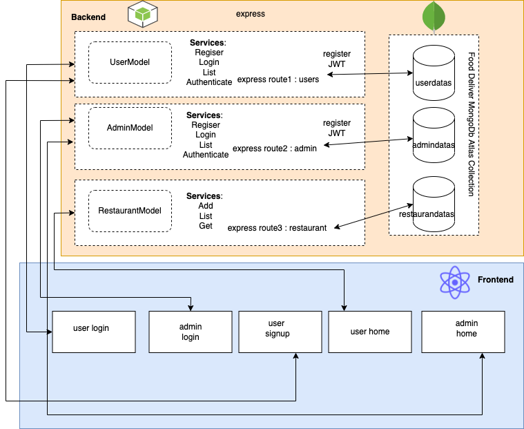

# FoodDeliveryTask
MERN full stack app

for backend service to start : 
from the backend directory run npm install and then npm run dev in your terminal.

for frontend service to start :
from the frontend directory run npm install and then run npm start in your terminal.
in frontend you have [user login, user signup and admin login]
Once you do user signup you will be able to do user login with your user credentials.

Architecture Diagram :

